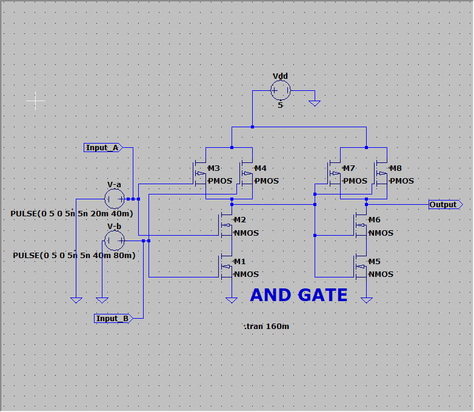
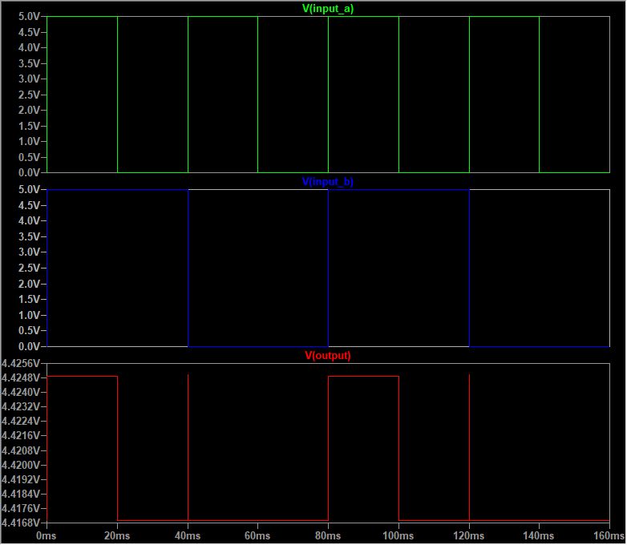

# CMOS AND Gate in LTspice  

## Overview  
This repository contains the implementation and simulation of a CMOS AND gate using LTspice. The AND gate is a fundamental building block in digital logic circuits, producing a HIGH output only when all inputs are HIGH. This project explores the CMOS-based design of an AND gate and its transient behavior in a VLSI context.  

## Repository Structure  
The repository includes the following files:  
- **`And_gate.asc`**: The LTspice schematic file for the CMOS AND gate.  
- **`And_gate.png`**: Circuit diagram of the CMOS AND gate.  
- **`And_gate_Output.png`**: Simulation output waveform demonstrating the AND gate's transient response.  
- **`And_gate_Netlist.txt`**: The netlist of the CMOS AND gate generated by LTspice.  

## Design Details  

### CMOS Implementation  
The CMOS AND gate combines complementary MOSFETs (PMOS and NMOS) to achieve efficient logic operation.  

#### Key Points:  
1. **Pull-Up Network (PUN):**  
   - Consists of PMOS transistors configured to ensure the output is pulled to VDD (Logic HIGH) only when both inputs are HIGH.  
2. **Pull-Down Network (PDN):**  
   - Comprises NMOS transistors arranged to connect the output to GND (Logic LOW) when at least one input is LOW.  

#### Transistor Configuration:  
| **Transistor** | **Connection Details**                          |  
|-----------------|-------------------------------------------------|  
| M1, M2          | NMOS for PDN, forming a series path for GND.    |  
| M3, M4          | PMOS for PUN, forming a parallel path for VDD.  |  
| M5, M6          | NMOS for intermediate stages.                   |  
| M7, M8          | PMOS for intermediate stages.                   |  

### Input Voltage Details  
- **Input A (`V-a`):**  
  A pulsed input signal ranging from 0V (Logic LOW) to 5V (Logic HIGH), with a pulse width of 20 ms and a period of 40 ms.  

- **Input B (`V-b`):**  
  A pulsed input signal ranging from 0V to 5V, with a pulse width of 40 ms and a period of 80 ms.  

### Power Supply Voltage  
- **VDD (`N001`):**  
  A constant supply voltage of 5V.  

### Transient Analysis  
The transient analysis (`.tran 160m`) is used to observe the dynamic behavior of the AND gate as the inputs toggle. The simulation captures the propagation delay, rise/fall times, and the steady-state behavior.  

## Simulation Results  
The transient response of the AND gate demonstrates the following:  
- **Logic HIGH Output (5V):**  
  Occurs only when both Input A and Input B are HIGH simultaneously.  
- **Logic LOW Output (0V):**  
  Produced when either or both inputs are LOW.  

Refer to **`And_gate_Output.png`** for the waveform showing the relationship between the input signals (`Input A`, `Input B`) and the output (`AND Gate Output`).  

## Instructions for Reproduction  

1. **Install LTspice**  
   Download and install LTspice from the [official website](https://www.analog.com/en/design-center/design-tools-and-calculators/ltspice-simulator.html).  

2. **Clone this Repository**  
   Clone the repository to your local system:  
   ```bash  
   git clone <repository_link>  
   cd <repository_folder>  
3. **Open the Schematic**  
   Open the file `And_gate.asc` in LTspice.  

4. **Run the Simulation**  
   - In LTspice, navigate to **Simulate > Run** or press the **Run** button.  
   - Observe the transient response to verify the AND gate's behavior.  

5. **Analyze the Waveforms**  
   - The output should only transition to HIGH (5V) when both Input A and Input B are HIGH.  
   - Analyze propagation delays, rise and fall times, and verify the circuit's logical correctness.  

## Applications  
The CMOS AND gate plays a critical role in VLSI systems, with the following applications:  
- **Logic Circuitry:** Building combinational circuits such as decoders, multiplexers, and arithmetic units.  
- **Digital Signal Processing (DSP):** Used in core functional blocks of DSP chips.  
- **Low-Power Design:** CMOS technology ensures minimal static power consumption in steady states, essential for power-sensitive applications like mobile devices.  
- **High-Speed Logic:** The transient analysis in LTspice aids in understanding and optimizing the gate's delay, critical for high-frequency applications.  

## Contributions  
Contributions to this project are welcome! If you identify any issues, have ideas for improvement, or want to add new features, feel free to:  
- Open an issue in the repository.  
- Submit a pull request with your changes.  


---

## Circuit Diagram  
Below is the CMOS AND gate circuit diagram:  
  

## Simulation Output  
The transient response of the AND gate is shown below, where the output transitions based on the input signals (`Input A` and `Input B`).  

  
