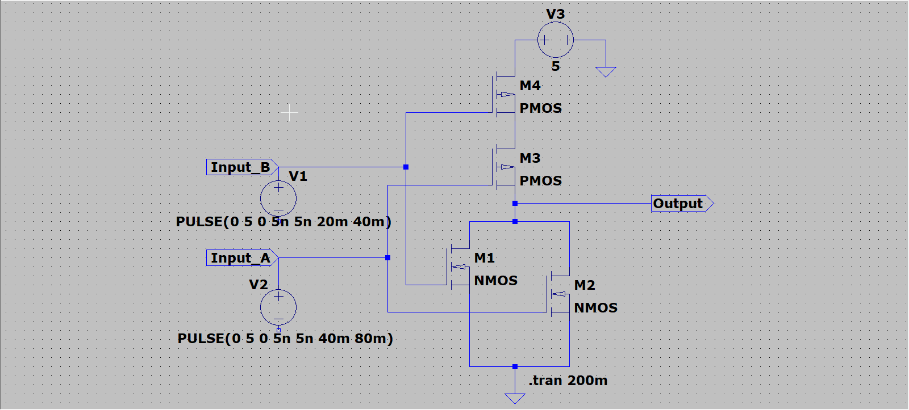
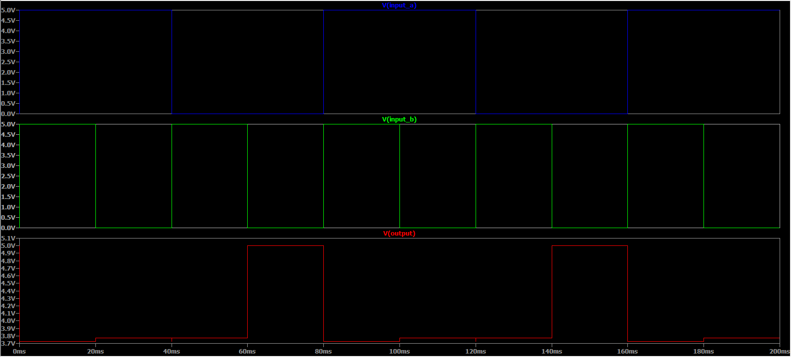

# CMOS NOR Gate in LTspice  

## Overview  
This repository contains the implementation and simulation of a CMOS NOR gate using LTspice. The NOR gate is a universal logic gate that outputs **LOW (Logic 0)** when any input is **HIGH (Logic 1)** and outputs **HIGH (Logic 1)** only when all inputs are **LOW (Logic 0)**. This project delves into the CMOS-based NOR gate design and its transient behavior in a VLSI context.  

## Repository Structure  
The repository includes the following files:  
- **`Nor_gate.asc`**: The LTspice schematic file for the CMOS NOR gate.  
- **`Nor_gate_ckt.png`**: Circuit diagram of the CMOS NOR gate.  
- **`Nor_gate_op.png`**: Simulation output waveform showcasing the NOR gate's transient response.  
- **`Nor_gate.net`**: The netlist of the CMOS NOR gate generated by LTspice.  

## VLSI Design Details  

### CMOS Implementation  
The CMOS NOR gate uses complementary MOSFETs (PMOS and NMOS) to implement the NOR logic with high efficiency and low static power consumption.  

#### Key Points:  
1. **Pull-Up Network (PUN):**  
   - A parallel configuration of PMOS transistors ensures that the output is pulled HIGH (VDD) only when all inputs are LOW.  
2. **Pull-Down Network (PDN):**  
   - A series arrangement of NMOS transistors connects the output to GND when any input is HIGH.  

#### Transistor Configuration:  
| **Transistor** | **Connection Details**                          |  
|-----------------|-------------------------------------------------|  
| M1, M2          | NMOS transistors forming the PDN (series path). |  
| M3, M4          | PMOS transistors forming the PUN (parallel path). |  

### Input Voltage Details  
- **Input A (`V2`):**  
  A pulsed input signal ranging from 0V (Logic LOW) to 5V (Logic HIGH), with a pulse width of 40 ms and a period of 80 ms.  

- **Input B (`V1`):**  
  A pulsed input signal ranging from 0V to 5V, with a pulse width of 20 ms and a period of 40 ms.  

### Power Supply Voltage  
- **VDD (`V3`):**  
  A constant supply voltage of 5V.  

### Transient Analysis  
The transient analysis (`.tran 200m`) is performed to observe the NOR gate's dynamic behavior as inputs toggle. Key metrics include propagation delays, rise/fall times, and logical correctness.  

## Truth Table  
The CMOS NOR gate operates as per the following truth table:  

| **Input A** | **Input B** | **Output (Y)** |  
|-------------|-------------|----------------|  
| 0           | 0           | 1              |  
| 0           | 1           | 0              |  
| 1           | 0           | 0              |  
| 1           | 1           | 0              |  

## Simulation Results  
The simulation output verifies the expected NOR gate behavior:  
- The output is **HIGH (5V)** only when both inputs are LOW.  
- For all other input combinations, the output is **LOW (0V)**.  

Refer to **`Nor_gate_Output.png`** for the waveform illustrating the relationship between `Input A`, `Input B`, and the `NOR Gate Output`.  

## Instructions for Reproduction  

1. **Install LTspice**  
   Download and install LTspice from the [official website](https://www.analog.com/en/design-center/design-tools-and-calculators/ltspice-simulator.html).  

2. **Clone this Repository**  
   Clone the repository to your local system:  
   ```bash  
   git clone <repository_link>  
   cd <repository_folder>  
3. **Open the Schematic**  
   Open the file `Nor_gate.asc` in LTspice.  

4. **Run the Simulation**  
   - Navigate to **Simulate > Run** or press the **Run** button in LTspice.  
   - The transient analysis will execute, displaying the input signals (`Input A` and `Input B`) and the output (`NOR Gate Output`).  

5. **Analyze the Results**  
   Verify the transient response and ensure that the output waveform aligns with the truth table of a NOR gate.  

## Applications in VLSI  
The CMOS NOR gate is a versatile building block in digital logic design and finds applications in:  
- **Logic Design:** Implementation of combinational logic and sequential circuits.  
- **Universal Logic Gate:** Any logic function can be synthesized using only NOR gates.  
- **Power-Efficient Systems:** CMOS technology minimizes power consumption due to low static current.  

## Contributions  
Contributions are welcome! If you have ideas for improvements or additional features, please:  
- Open an issue in the repository.  
- Submit a pull request with your changes.  

---

## Circuit Diagram  
Below is the CMOS NOR gate circuit diagram:  
  

## Simulation Output  
The transient response of the NOR gate is shown below, highlighting the relationship between `Input A`, `Input B`, and the `NOR Gate Output`:  
  
