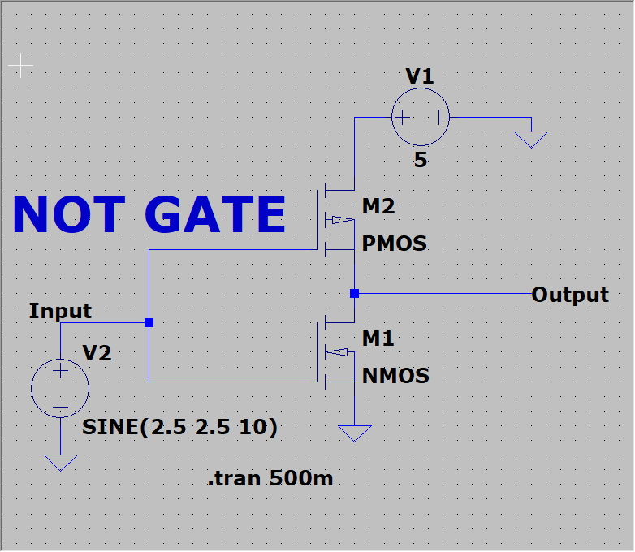
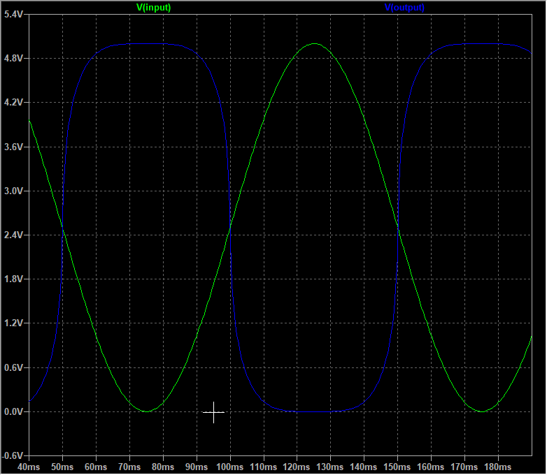

# CMOS NOT Gate in LTspice  

## Overview  
This repository contains the implementation and simulation of a CMOS NOT gate using LTspice. The NOT gate (inverter) outputs the logical complement of its input. This project demonstrates the CMOS-based NOT gate's design principles, behavior, and simulation results.  

## Repository Structure  
The repository includes the following files:  
- **`NOT_GATE.asc`**: The LTspice schematic file for the CMOS NOT gate.  
- **`NOT_GATE.png`**: Circuit diagram of the CMOS NOT gate.  
- **`NOT_GATE_Output.png`**: Simulation output waveform showing the NOT gate's functionality.  
- **`NOT_GATE_Netlist.txt`**: The netlist of the CMOS NOT gate, generated by LTspice.  

## Design Details  

### Components Used  
- **PMOS Transistor**  
- **NMOS Transistor**

  

### Working Principle  
- When the input is **HIGH (Logic 1)**:  
  - The PMOS transistor turns **OFF**, and the NMOS transistor turns **ON**, connecting the output to ground (**Logic 0**).  
- When the input is **LOW (Logic 0)**:  
  - The PMOS transistor turns **ON**, and the NMOS transistor turns **OFF**, connecting the output to the power supply (**Logic 1**).  

This complementary structure ensures efficient operation with low power consumption in steady states.  

## Simulation Results  
The simulation verifies the expected behavior of the NOT gate:  
- The output is the inverted form of the input signal.  
- Rise and fall times are observed within typical ranges for CMOS circuits.  

 

## How to Use  

1. **Install LTspice**  
   Download and install LTspice from the [official website](https://www.analog.com/en/design-center/design-tools-and-calculators/ltspice-simulator.html).  

2. **Clone this Repository**  
   Clone the repository to your local system:  
   ```bash  
   git clone <repository_link>  
   cd <repository_folder>
   
3. **Open the Schematic**  
   Open the file `NOT_GATE.asc` in LTspice.  

4. **Run the Simulation**  
   Run the simulation to observe the output waveform and verify the functionality.  

## Applications  
- Digital logic circuit design and analysis.  
- Education and learning resource for CMOS inverter functionality.  
- Foundational design for more complex digital CMOS circuits.  
---
